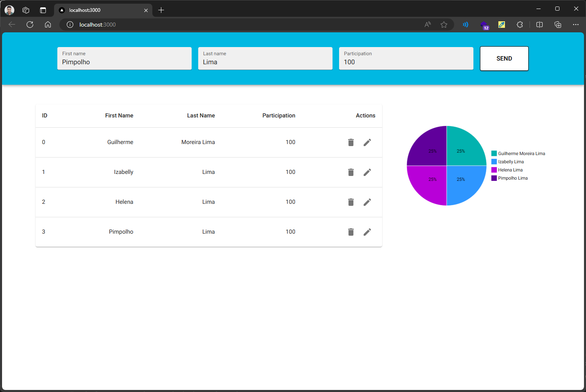

# Fullstack Challenge



## Descrição

O Fullstack Challenge é um projeto que oferece uma solução completa para desenvolvedores interessados em iniciar rapidamente com uma API GraphQL e um front-end integrado.

## Como Iniciar

Para começar, você deve seguir as instruções nos README.md de cada projeto listado abaixo:

- [**App**](./app/README.md): Contém o front-end da aplicação desenvolvida com Next.js e Material-UI.
- [**API**](./api/README.md): Contém a API GraphQL desenvolvida com Apollo Server e TypeScript, integrada com MongoDB.

### Iniciando o App

Para iniciar o projeto `app`:

1. Navegue até o diretório `app`:

   ```
   cd app
   ```

2. Instale a versão especificada do Node.js utilizando o NVM:

   ```
   nvm install
   ```

3. Instale as dependências do projeto utilizando npm:

   ```
   npm install
   ```

4. Inicie o projeto em modo de desenvolvimento:

   ```
   npm run dev
   ```

### Iniciando a API

Para iniciar o projeto `api`:

1. Navegue até o diretório `api`:

   ```
   cd api
   ```

2. Instale a versão especificada do Node.js utilizando o NVM (se necessário):

   ```
   nvm install
   ```

3. Instale as dependências do projeto utilizando npm:

   ```
   npm install
   ```

4. Inicie o contêiner do MongoDB utilizando Docker Compose:

   ```
   npm run services:up
   ```

5. Inicie o servidor da API:

   ```
   npm run dev
   ```

## Contribuindo

Sinta-se à vontade para contribuir com novas funcionalidades, correções de bugs ou melhorias para o projeto. Basta seguir as instruções no README.md de cada projeto.

Para contribuir com o projeto `app`:

1. Siga as instruções no [README.md do App](./app/README.md).
2. Faça suas alterações e abra um Pull Request no repositório original.

Para contribuir com o projeto `api`:

1. Siga as instruções no [README.md da API](./api/README.md).
2. Faça suas alterações e abra um Pull Request no repositório original.

## Licença

Este projeto é licenciado sob a [MIT License](LICENSE).
